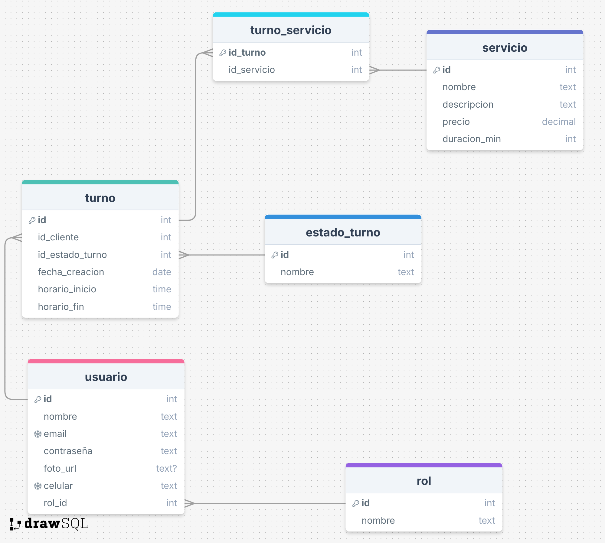

# barbershop-app
Proyecto Barbería - Lab VI

## Aplicaciones del estilo Barbershop
- [The Cut Barbershop](https://play.google.com/store/apps/details?id=mobi.barberly.thecut&hl=es_AR)
- [The Barber Job](https://play.google.com/store/search?q=the%20barber%20job&c=apps&hl=es_AR)
- [TheCut disponible en Apple](https://apps.apple.com/us/app/thecut-barbershop-booking/id1101408626?mt=8)

---

## Documentación del proyecto

### Requerimientos

Las principales características que la app a desarrollar para los clientes tiene como objetivo simplificar el proceso de reserva, para lo cual debe permitir:

1. **Registrar y gestionar el perfil del cliente**  
   - Permitir a los usuarios crear una cuenta, iniciar y cerrar sesión.  
   - Administrar su información personal, como nombre, número de contacto, foto, etc.

2. **Reserva y gestión de turnos fácil y rápida**  
   - Permite reservar servicios en cualquier momento y lugar.  
   - Agenda en tiempo real con disponibilidad actualizada.  
   - Cancelar o reprogramar citas sin necesidad de llamar.

3. **Acceso a información detallada**  
   - Ofrecer un catálogo detallado de los servicios disponibles (cortes de pelo, afeitados, tratamientos, etc.) con descripciones, precios y promociones.  
   - Perfiles del personal con sus especialidades y calificaciones.

4. **Personalización y recomendaciones**  
   - Historial de servicios y preferencias.

5. **Valoraciones y comentarios**  
   - Permitir calificar y opinar sobre la experiencia.

6. **Notificaciones y recordatorios**  
   - Recordatorios de turnos próximos.  
   - Promociones y novedades.  
   - Notificaciones sobre cualquier cambio como cancelaciones de turnos.

---

### Imágenes y diagramas

